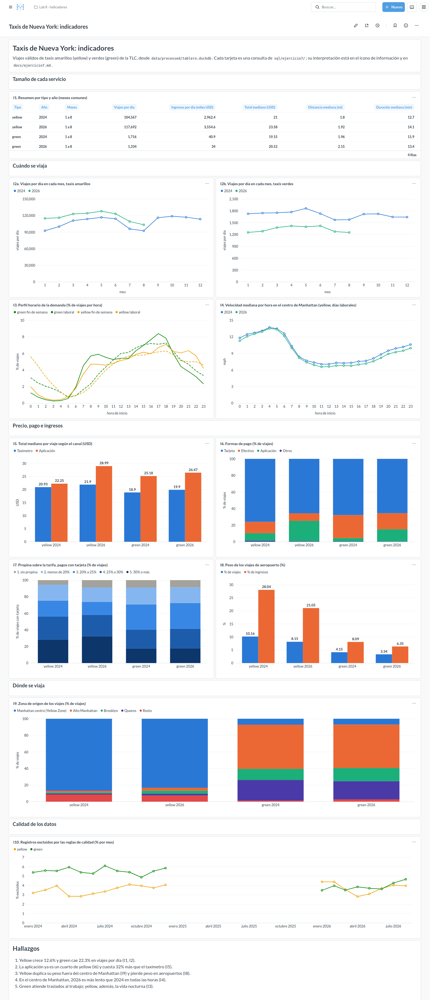

# Ejercicio 7 - Indicadores y tablero

Tablero en Metabase con 10 indicadores. Cada uno responde una pregunta, se
calcula con una consulta de `sql/ejercicio7/` y se muestra con su
interpretación.

| Archivo | Contenido |
|---|---|
| `sql/ejercicio7/00_construir_tablas.sql` | tablas y vista del tablero |
| `sql/ejercicio7/i01` a `i10` | una consulta por indicador |
| `scripts/construir_tablero.py` | construye `data/processed/tablero.duckdb`, verifica el cuadre y prueba los indicadores |
| `scripts/metabase_tablero.py` | crea o actualiza el tablero en Metabase mediante la API |
| `notebooks/05_indicadores.ipynb` | resultados de los indicadores |
| `docs/ejercicio7_tablero.png` | captura del tablero |

Datos: 2024 completo y enero a agosto de 2026, yellow y green (71,870,407
registros). Los resultados son anteriores al ajuste de la regla de montos del
Ejercicio 8; las cifras con los tres años están en `docs/ejercicio8.md`.

## Cómo ejecutar

```bash
docker compose exec lab python scripts/construir_tablero.py
docker compose exec lab python scripts/metabase_tablero.py
```

El segundo script imprime la URL del tablero. Si Metabase no está configurado,
crea el administrador `lab8@example.com` / `lab8-duckdb-2026` (solo para el
ambiente local); si ya existe uno, se usan `--email` y `--password`. Puede
ejecutarse varias veces sin duplicar nada. Tras reconstruir la base hay que
reiniciar Metabase (`docker compose restart metabase`).

## Diseño

El tablero no lee los Parquet sino una base materializada, porque Metabase
repite las mismas consultas en cada apertura (Ej. 6, 6.10). La base se
construye a partir de las vistas del Ejercicio 4, así que aplica las mismas
reglas de calidad. Metabase la abre en solo lectura.

| Objeto | Filas | Contenido |
|---|---:|---|
| `viajes` | 69,256,941 | viajes válidos, 16 columnas |
| `viajes_comparables` | vista | `viajes` en los meses presentes en todos los años |
| `zonas` | 265 | zonas de la TLC |
| `calidad_mensual` | 40 | registros y exclusiones por regla, tipo y mes |

Transformaciones (todas en `00_construir_tablas.sql`):

- Solo viajes que cumplen las reglas del Ej. 4.
- Regla nueva: se excluyen los viajes de más de 80 mph (Ej. 4, P15), evaluada
  con duraciones de 1 min o más. Elimina 6,586 registros (0.01%).
- Se conservan 16 columnas, con tipos enteros pequeños y `velocidad_mph`
  precalculada. Duración y velocidad se redondean a 2 decimales: la base pasó
  de 2,219 a 1,436 MiB.
- Los 11 duplicados del Ej. 5 se conservan; no cambian ningún indicador.

Verificación: para cada tipo y año, registros menos excluidos coincide con las
filas de `viajes`. Si no, el script se detiene sin reemplazar la base.

| tipo | año | registros | excluidos | viajes |
|---|---:|---:|---:|---:|
| yellow | 2024 | 41,169,720 | 1,459,760 | 39,709,960 |
| green | 2024 | 660,218 | 36,535 | 623,683 |
| yellow | 2026 | 29,703,355 | 1,104,123 | 28,599,232 |
| green | 2026 | 337,114 | 13,048 | 324,066 |

Los indicadores que comparan años (I1 e I4 a I9) usan `viajes_comparables`,
porque 2026 solo tiene enero a agosto y septiembre a diciembre son meses de
alta demanda. Con el año completo, el crecimiento de yellow daba +8.5%; con
meses comunes, +12.6%, igual que en el Ej. 5. Los meses comunes se calculan
desde los datos, así que al agregar 2025 (Ej. 8) basta con reconstruir la base.

## 7.1, 7.2 y 7.6 Preguntas e indicadores

| Indicador | Pregunta | Visualización | Justificación |
|---|---|---|---|
| I1 | ¿Qué tamaño tiene cada servicio y cómo cambia entre años? | tabla | da la escala; usa valores por día y medianas |
| I2 | ¿Cómo evoluciona la demanda durante el año y entre años? | dos líneas, una por tipo | separa estacionalidad y tendencia; yellow tiene 88 veces más viajes, por eso no comparten eje |
| I3 | ¿A qué horas se usa cada servicio? | líneas; punteadas para el fin de semana | muestra el uso de cada servicio (Ej. 4, P2) |
| I4 | ¿Cómo cambia la congestión durante el día y entre años? | líneas por año | la velocidad mide la congestión; se limita al centro de Manhattan, donde se cobra el cargo por congestión desde 2025 |
| I5 | ¿Cuánto cuesta un viaje y cuánto más por aplicación? | barras agrupadas | la aplicación es el mayor cambio del conjunto (Ej. 4, P11) |
| I6 | ¿Cómo pagan los pasajeros? | barras apiladas al 100% | partes de un todo |
| I7 | ¿Cuánta propina se deja? | barras apiladas, rampa de azules | tramos ordenados; solo tarjeta (Ej. 4, P9) |
| I8 | ¿Cuánto aportan los aeropuertos? | barras agrupadas | pocos viajes, muchos ingresos (Ej. 4, P8) |
| I9 | ¿Dónde opera cada servicio? | barras apiladas al 100% | verifica la separación de mercados (Ej. 4, P6) |
| I10 | ¿Qué tan confiables son los datos de cada mes? | líneas sobre fechas | descarta que un cambio venga de un mes defectuoso |

Se descartaron indicadores de pasajeros y de componentes de la tarifa, porque
esos campos dependen del proveedor (Ej. 4, P5, P13 y P17).

## 7.3, 7.7 y 7.8 Resultados e interpretación

Cada archivo SQL indica en su encabezado el indicador y la pregunta. Los
resultados completos están en el notebook.

### I1 - `i01_resumen_anual.sql`

| tipo | año | viajes/día | ingresos/día (miles USD) | total mediano | distancia mediana | duración mediana |
|---|---:|---:|---:|---:|---:|---:|
| yellow | 2024 | 104,567 | 2,962.4 | 21.00 | 1.80 | 12.7 |
| yellow | 2026 | 117,692 | 3,554.6 | 23.58 | 1.92 | 14.1 |
| green | 2024 | 1,716 | 40.9 | 19.15 | 1.96 | 11.9 |
| green | 2026 | 1,334 | 34.0 | 20.52 | 2.15 | 13.4 |

Yellow sube 12.6% en viajes y 20.0% en ingresos por día; green baja 22.3% y
16.9%. En ambos el viaje mediano es más caro y dura 1.4 a 1.5 min más.

### I2 - `i02a_demanda_yellow.sql`, `i02b_demanda_green.sql`

| | ene | feb | mar | abr | may | jun | jul | ago |
|---|---:|---:|---:|---:|---:|---:|---:|---:|
| yellow, variación 2026/2024 | +24.1% | +16.0% | +10.8% | +9.1% | +9.6% | +7.8% | +13.9% | +11.7% |
| green, variación 2026/2024 | -27.3% | -26.5% | -21.4% | -19.9% | -25.0% | -17.9% | -18.9% | -20.7% |

Ambos tipos tienen la misma estacionalidad (pico en mayo, caída en julio y
agosto, recuperación en septiembre), pero tendencias opuestas en todos los
meses.

### I3 - `i03_perfil_horario.sql`

En días laborales, green tiene picos a las 8 y 9 h (5.7% y 5.9% de sus viajes)
y a las 17 h (8.4%). Yellow sigue alto hasta las 22 h (5.7% a 6.3% entre 20 y
22 h, contra 3.2% a 4.4% en green). El fin de semana, de 0 a 4 h ocurre el
15.4% de los viajes de yellow y el 9.3% de los de green.

### I4 - `i04_velocidad_hora.sql`

| hora | 4 | 8 | 11 | 15 | 18 | 21 |
|---|---:|---:|---:|---:|---:|---:|
| 2024 (mph) | 13.70 | 8.39 | 7.05 | 7.30 | 8.09 | 9.91 |
| 2026 (mph) | 13.53 | 8.19 | 6.56 | 6.76 | 7.58 | 9.23 |

De 10 a 17 h se circula a unas 7 mph, la mitad que de madrugada. 2026 es más
lento en las 24 horas: 1% a 2% de 2 a 5 h y 6% a 7.4% de 10 a 23 h. Si el
cargo por congestión de 2025 mejoró la velocidad, el efecto no llegó a 2026; el
Ej. 8 permitirá ver 2025.

### I5 - `i05_costo_viaje.sql`

| | yellow 2024 | yellow 2026 | green 2024 | green 2026 |
|---|---:|---:|---:|---:|
| taxímetro (USD) | 20.93 | 21.90 | 18.90 | 19.90 |
| aplicación (USD) | 22.25 | 28.99 | 25.18 | 26.47 |
| diferencia | +6% | +32% | +33% | +33% |

En yellow, el mediano por aplicación sube 30% y el de taxímetro 5%. Se usa el
total porque la tarifa mediana es 13.50 USD en todos los grupos (la tarifa
avanza en escalones) y los componentes de los viajes por aplicación están
incompletos (Ej. 4, P13). No compara el mismo trayecto.

### I6 - `i06_formas_pago.sql`

| | tarjeta | efectivo | aplicación | otros |
|---|---:|---:|---:|---:|
| yellow 2024 | 75.92 | 13.79 | 8.99 | 1.30 |
| yellow 2026 | 65.65 | 9.10 | 24.62 | 0.63 |
| green 2024 | 67.75 | 27.78 | 4.01 | 0.45 |
| green 2026 | 65.54 | 19.41 | 14.71 | 0.34 |

La aplicación casi se triplica en yellow, a costa de la tarjeta, y se
multiplica por 3.7 en green, a costa del efectivo.

### I7 - `i07_propinas.sql`

| | sin propina | < 20% | 20% a 25% | 25% a 30% | 30% o más |
|---|---:|---:|---:|---:|---:|
| yellow 2024 | 5.56 | 19.16 | 19.34 | 27.69 | 28.25 |
| yellow 2026 | 8.79 | 17.42 | 15.88 | 25.73 | 32.18 |
| green 2024 | 8.81 | 20.45 | 30.40 | 22.85 | 17.49 |
| green 2026 | 8.66 | 19.06 | 30.93 | 23.68 | 17.66 |

Entre 71% y 75% deja 20% o más, por las propinas sugeridas en pantalla. En
yellow crecen a la vez el 30% o más y los viajes sin propina; green es estable.

### I8 - `i08_aeropuertos.sql`

| | yellow 2024 | yellow 2026 | green 2024 | green 2026 |
|---|---:|---:|---:|---:|
| % de viajes | 10.16 | 8.15 | 4.15 | 3.34 |
| % de ingresos | 28.04 | 21.05 | 8.09 | 6.35 |

Un viaje de aeropuerto de yellow ingresa unas 3.4 veces lo que uno urbano. Con
I1, sus viajes de aeropuerto bajan de unos 10,600 a 9,600 por día: el
crecimiento de yellow es urbano.

### I9 - `i09_zona_origen.sql`

| | Manhattan centro | alto Manhattan | Brooklyn | Queens | resto |
|---|---:|---:|---:|---:|---:|
| yellow 2024 | 86.85 | 2.06 | 1.25 | 1.25 | 8.58 |
| yellow 2026 | 83.23 | 3.49 | 3.56 | 2.30 | 7.42 |
| green 2024 | 7.16 | 53.28 | 13.40 | 24.87 | 1.29 |
| green 2026 | 6.95 | 52.51 | 15.81 | 22.01 | 2.72 |

Los mercados siguen separados, pero yellow pasa de 4.6% a 9.4% de viajes desde
alto Manhattan, Brooklyn y Queens: unos 11 mil por día, ocho veces el volumen
de green. Coincide con el crecimiento de la aplicación (I6), aunque los datos
no prueban que yellow le quite pasajeros a green.

### I10 - `i10_calidad_mensual.sql`

Se excluye entre 2.8% y 6.1% de los registros por mes, sin saltos. Green mejora
(4.9% a 6.1% en 2024, 3.5% a 4.7% en 2026). La causa principal es la distancia
cero; en yellow 2024 también los montos negativos (733,885).

## 7.4 y 7.5 Tablero



El script crea el tablero completo, así que su definición queda versionada. Se
lee en cinco secciones: tamaño, cuándo, precio y pago, dónde y calidad, y cierra
con los hallazgos. Las secciones se leen juntas: la caída de green (I2) se
explica con I6 e I9, y la caída de los aeropuertos (I8) con I9.

- Líneas para ejes ordenados, barras agrupadas para pocas magnitudes, barras
  apiladas para partes de un todo y tabla para valores exactos.
- Nunca dos ejes verticales; con escalas muy distintas, dos gráficas (I2).
- Yellow y green con los colores del notebook del Ej. 4. Años y categorías con
  una paleta validada para daltonismo; 2025 ya tiene color. Por esa validación,
  I9 se limitó a cinco categorías.
- El amarillo tiene poco contraste, por eso todas las gráficas llevan leyenda.

## Hallazgos

1. Yellow crece 12.6% y green cae 22.3% en viajes por día (I1, I2).
2. La aplicación pasa de 9% a 25% de yellow (I6) y cuesta 32% más que el
   taxímetro (I5).
3. Yellow duplica su peso fuera del centro de Manhattan (I9) y pierde peso en
   aeropuertos (I8).
4. En el centro de Manhattan, 2026 es 1% a 7% más lento que 2024 en todas las
   horas (I4).
5. Green atiende traslados al trabajo; yellow, además, la vida nocturna (I3).
