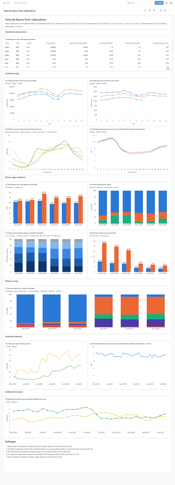

# Ejercicio 8 - Incorporación de 2025 y análisis completo

| Archivo | Contenido |
|---|---|
| `scripts/download_data.py` | `ANIOS = (2024, 2025, 2026)` |
| `sql/ejercicio7/00_construir_tablas.sql` | ajuste de la regla de montos (Flex Fare con tarifa negativa) |
| `sql/ejercicio8/i11_aplicacion_mensual.sql`, `i12_velocidad_mensual.sql` | indicadores nuevos de evolución mensual |
| `sql/ejercicio8/01_flex_tarifa_negativa.sql` | análisis de la anomalía de 2025 |
| `notebooks/06_incorporacion_2025.ipynb` | validación, prueba de las consultas anteriores y evolución |
| `docs/ejercicio8_tablero.png` | captura del tablero con los tres años |

## Cómo ejecutar

```bash
docker compose exec lab python scripts/download_data.py        # descarga solo 2025
docker compose exec lab python scripts/construir_tablero.py
docker compose restart metabase
docker compose exec lab python scripts/metabase_tablero.py
docker compose exec lab jupyter nbconvert --to notebook --execute --inplace \
    notebooks/06_incorporacion_2025.ipynb
```

## 8.1 Cambio al sistema de descarga

Solo se agregó 2025 a la constante `ANIOS`. El resto del script ya recibía el
año como parámetro desde el Ejercicio 5.

## 8.2 Los archivos existentes no se descargan de nuevo

Antes de la descarga se guardó el tamaño y la fecha de modificación de los 40
Parquet de 2024 y 2026 y de la tabla de zonas. Después, ambos listados fueron
idénticos.

| Ejecución | Descargados | Ya existían | No publicados | Fallidos |
|---|---:|---:|---:|---:|
| primera | 24 (2025) | 40 | 8 (sep. a dic. de 2026) | 0 |
| segunda | 0 | 64 | 8 | 0 |

Los manifiestos de 2024 y 2026 se reescriben en cada ejecución: sus filas pasan
de `descargado` a `existente`, con los mismos bytes y filas.

Las consultas 01 a 04 del Ejercicio 5 leen todos los años con un glob y validan
2025 sin cambios: 12 meses por tipo, manifiestos iguales a la metadata
(48,722,602 registros yellow y 591,375 green) y un esquema compatible.
`cbd_congestion_fee` aparece en enero de 2025, cuando empezó el cargo por
congestión. En total hay 64 archivos y 121,184,384 registros.

## 8.3 Las consultas anteriores siguen funcionando

El notebook ejecuta, sin modificarlas, todas las consultas de los Ejercicios 4
a 8 sobre los tres años:

| Ejercicio | Consultas | Sin error | Segundos |
|---|---:|---:|---:|
| 4 (sobre las vistas) | 17 | 17 | 99.9 |
| 5 | 7 | 7 | 18.9 |
| 6 (sobre la vista Parquet de todos los años) | 6 | 6 | 15.0 |
| 7 (sobre `tablero.duckdb`) | 11 | 11 | 11.1 |
| 8 | 2 | 2 | 1.3 |

Tiempos en la máquina de prueba (16 CPU). La más lenta es la 15 del Ejercicio 4
(IQR, 31 s).

- Las consultas del Ejercicio 4 que agrupan solo por `tipo` mezclan los tres
  años, como ya señaló el Ej. 5 (5.7). El análisis por año está en los
  indicadores del tablero.
- Las del Ejercicio 3 fijan `/2026/` en la ruta y siguen siendo la exploración de
  2026 (Ej. 5, 5.7).
- Las tablas del benchmark (`taxis.duckdb`) siguen con 2024 y 2026. No se
  regeneraron para conservar la evidencia del Ejercicio 6; `benchmark.py
  --recrear` las actualiza.
- El tablero solo requirió reconstruir la base y reiniciar Metabase. Gracias a
  `viajes_comparables`, las comparaciones entre años pasaron solas a usar enero
  a agosto de los tres años.

### Ajuste: Flex Fare con tarifa negativa en 2025

Al reconstruir la base, yellow 2025 excluía 8.2% de sus registros, contra 3% a
4% en los otros años. La causa eran viajes Flex Fare con `fare_amount`
negativo (`01_flex_tarifa_negativa.sql`):

| Periodo | Flex Fare con tarifa negativa | Distancia mediana: negativa / resto (mi) |
|---|---:|---:|
| 2024 | 1.5% a 3.7% por mes | 1.7 a 2.1 / 2.0 a 2.5 |
| enero a noviembre de 2025 | 15% a 34% por mes | 2.0 a 2.8 / 2.1 a 2.9 |
| desde diciembre de 2025 | 0% | |

Todos son de VendorID 2, tienen distancias normales y un total de 2.5 a 4.2 USD. Son viajes reales con los montos mal capturados durante 11 meses. Se
tratan como la duración de Helix (Ej. 4, P16): se conservan, con tarifa, propina
y total en `NULL`. La regla se aplica en la base del tablero y no en las vistas
del Ejercicio 4, para no alterar los resultados de los Ejercicios 4 a 6.

| tipo y año | excluidos antes | excluidos después | conservados sin montos |
|---|---:|---:|---:|
| yellow 2024 | 3.55% | 3.25% | 121,061 |
| yellow 2025 | 8.25% | 4.44% | 1,855,743 |
| yellow 2026 | 3.72% | 3.72% | 195 |

Sin el ajuste, 2025 habría perdido 4% de sus viajes yellow y la aplicación
habría quedado subestimada justo cuando más crece. Como esos viajes no tienen
montos, los ingresos por día de yellow 2025 (I1) quedan subestimados.

## 8.4 Indicadores actualizados

El tablero se actualizó con el mismo script. Los indicadores I1 a I10 ya
incluyen 2025 (color naranja) y se agregó la sección "Evolución mensual":

| Indicador | Pregunta | Por qué |
|---|---|---|
| I11 | ¿Cómo creció la contratación por aplicación entre 2024 y 2026? | con tres años, una serie continua muestra cuándo ocurre el cambio |
| I12 | ¿Cambió la congestión cuando empezó el cargo por congestión? | velocidad en el centro de Manhattan en el horario del cargo (días laborales, 5 a 21 h) |



## 8.5 Evolución de los indicadores

Comparaciones entre años en enero a agosto (`viajes_comparables`).

| Indicador | 2024 | 2025 | 2026 |
|---|---:|---:|---:|
| I1 yellow, viajes por día | 104,863 | 124,024 | 117,693 |
| I1 green, viajes por día | 1,716 | 1,552 | 1,334 |
| I1 yellow, total mediano (USD) | 21.00 | 21.57 | 23.58 |
| I5 yellow, taxímetro / aplicación (USD) | 20.93 / 22.25 | 21.42 / 22.80 | 21.90 / 28.99 |
| I6 aplicación, yellow / green | 9.3% / 4.0% | 22.5% / 6.9% | 24.6% / 14.7% |
| I6 efectivo, yellow / green | 13.8% / 27.8% | 9.7% / 23.1% | 9.1% / 19.4% |
| I7 yellow, propina de 30% o más / sin propina | 28.3% / 5.6% | 32.7% / 6.6% | 32.2% / 8.8% |
| I8 yellow, ingresos de aeropuertos | 28.0% | 24.6% | 21.1% |
| I9 yellow, viajes desde alto Manhattan, Brooklyn y Queens | 4.6% | 9.1% | 9.4% |

Series mensuales:

- I11: la aplicación en yellow pasa de 8.5% en diciembre de 2024 a 14.7% en
  enero y 21.7% en febrero de 2025, y desde entonces oscila entre 18% y 29%. En
  green sube de 5.5% en mayo de 2025 a 10.9% en julio y llega a 15% en 2026.
- I12: cada mes de 2025 está a menos de 2.3% del mismo mes de 2024. Entre enero
  y agosto, 2026 es entre 3.7% y 11.5% más lento que 2025.
- I2: 2025 supera a 2024 en los 12 meses. 2026 supera a 2025 en enero y queda
  por debajo de febrero a agosto (2% a 10%). Green cae en todos los meses de cada
  año. La estacionalidad es la misma en los tres años.
- I10: la exclusión queda entre 2.4% y 6.4% por mes. Green mejora desde junio de
  2025.

## 8.6 Cambios visibles al considerar los tres años

1. 2025 fue el año pico de yellow. Con 2024 y 2026 se veía un crecimiento de
   12.6%; en realidad yellow subió 18.3% en 2025 y bajó 5.1% en 2026. Green cae
   todos los años (-9.6% y -14.0%).
2. La aplicación cambió de golpe a inicios de 2025. En dos meses pasó de 8.5% a
   21.7% de yellow, y en el mismo año yellow duplicó su peso fuera del centro de
   Manhattan (de 4.6% a 9.1%). Ambos se estabilizan en 2026. En green el cambio
   llega medio año después.
3. El precio cambió después del volumen. El viaje por aplicación de yellow
   costaba 6% más que el de taxímetro en 2024 y 2025, y 32% más en 2026. Por eso,
   aunque 2026 tiene menos viajes que 2025, sus ingresos registrados por día son
   mayores (3.55 frente a 3.38 millones de USD; los de 2025 están subestimados,
   ver 8.3).
4. El cargo por congestión no mejoró la velocidad de los taxis. 2025 es igual a
   2024, mes a mes y hora a hora (I4, I12), y 2026 es más lento. El Ejercicio 7
   no podía distinguir entre una mejora temporal y ningún efecto; con 2025 se
   descarta la mejora. El filtro usa la Yellow Zone, más grande que la zona del
   cargo (al sur de la calle 60).
5. Los datos también cambian con el tiempo. La captura de montos de Flex Fare
   falló entre enero y noviembre de 2025; sin revisar 2025 aparte, se habrían
   perdido 1.9 millones de viajes.

## 8.7 Consultas utilizadas

| Consulta | Uso |
|---|---|
| `sql/ejercicio5/01` a `04` | validación de los archivos de 2025 (sin cambios) |
| `sql/ejercicio4`, `ejercicio5`, `ejercicio6/b*`, `ejercicio7/i*` | prueba de compatibilidad (8.3) |
| `sql/ejercicio8/01_flex_tarifa_negativa.sql` | anomalía de montos de 2025 |
| `sql/ejercicio7/00_construir_tablas.sql` | base del tablero con la regla ajustada |
| `sql/ejercicio7/i01` a `i10`, `sql/ejercicio8/i11`, `i12` | indicadores de 8.4 a 8.6 |

Los resultados completos están en `notebooks/06_incorporacion_2025.ipynb`.
